<div align="center">

# `[ F O R G E G U A R D ]`
<br/>



<br/>

**Autonomous Firebase Security Engineering.**<br/>
*A zero-trust policy orchestration engine for modern cloud architectures.*

<br/>

[]()
[]()
[]()
[]()

<br/>

[Overview](#-overview) • [Core Engine](#-core-engine) • [Installation](#-boot-sequence) • [Architecture](#-technical-architecture) • [Project Structure](#-project-structure)

</div>

---

## ⚡ Overview

**ForgeGuard** is an advanced, AI-driven platform designed to entirely automate the generation, auditing, and deployment of Firebase security rules (`firestore.rules`). 

Writing robust security rules manually is often error-prone, tedious, and difficult to test comprehensively. ForgeGuard solves this by providing a premium, highly interactive orchestration interface. Developers can simply describe their cloud architecture (e.g., *"SaaS with team workspaces and admin roles"*), and ForgeGuard's multi-agent AI system will autonomously reason about the data model, generate impenetrable security policies, and rigorously audit them before allowing deployment.

---

## 🛡️ Core Engine & Features

<table>
  <tr>
    <td width="50%">
      <h3>🧠 AI Orchestration Pipeline</h3>
      <p>Instead of relying on a single LLM prompt, ForgeGuard uses a specialized <b>Multi-Agent System</b>. When you describe your architecture, the engine streams a real-time reasoning trace showing exactly how the AI identifies collections, establishes access vectors, and defines zero-trust boundaries.</p>
    </td>
    <td width="50%">
      <h3>⚙️ Deterministic Rule Generation</h3>
      <p>The core generator (<code>agent-f</code>) outputs precise, structured, and syntax-highlighted <code>firestore.rules</code> blocks. It is engineered to handle highly complex relationships, role-based access control (RBAC), multi-tenant data isolation, and strict schema validation.</p>
    </td>
  </tr>
  <tr>
    <td width="50%">
      <h3>🔍 Autonomous Security Auditing</h3>
      <p>Every generated rule set is immediately piped into an independent <b>Auditor Agent</b>. The auditor calculates a Risk Score out of 100, provides a detailed vulnerability critique, and specifically hunts for critical security flaws like broad <code>if true;</code> statements or unprotected reads.</p>
    </td>
    <td width="50%">
      <h3>💬 Security Chat Interface</h3>
      <p>An integrated, interactive chat UI where developers can discuss security requirements, refine specific edge-cases, ask for explanations of specific rule blocks, and continuously dial in their security posture via conversational AI.</p>
    </td>
  </tr>
</table>

---

## 💻 Technical Architecture

ForgeGuard leverages the bleeding edge of modern web development to deliver a zero-latency, highly tactical user experience. 

### The Multi-Agent System
The backend orchestration (`src/app/api/orchestrate`) relies on several specialized AI agents powered by `gemini-2.5-pro` and `gemma-4.31B`:
1. **`reasoning.ts`**: Analyzes the user's plain-English prompt and constructs a structural map of the requested database.
2. **`simulator.ts`**: Generates hypothetical attack vectors and read/write scenarios based on the structure.
3. **`agent-f.ts`**: The core generator that synthesizes the logic into actual Firebase Security Rules syntax.
4. **`auditor.ts`**: A separate intelligence that aggressively reviews the generated rules for exploits and assigns a deterministic Risk Score.
5. **`deploy.ts`**: Packages the final verified rules into an actionable deployment plan.

All data is streamed to the client using **Server-Sent Events (SSE)**, creating a highly engaging, real-time interface.

### The UI Matrix
The frontend utilizes a custom-defined **Monochrome Cyber-Security** theme. The primary interactive element is the `grid-background` component, which implements a high-performance `requestAnimationFrame` loop. It continuously calculates radial distances between thousands of canvas nodes and the user's cursor, applying velocity and friction vectors for an organic, tactile repulsion effect.

---

## 📂 Project Structure

This repository is structured as an enterprise-grade Turborepo monorepo:

```text
forgeguard/
├── apps/
│   └── web/                      # Core Next.js 15 Application
│       ├── src/
│       │   ├── app/              # App Router (/, /orchestration, /api)
│       │   ├── components/       # React 19 UI Components
│       │   │   ├── chat/         # Conversational Security UI
│       │   │   ├── orchestration/# Multi-Agent Dashboard UI
│       │   │   └── ui/           # Custom shadcn/ui library
│       │   └── lib/
│       │       └── agents/       # AI Agent Definitions (agent-f, auditor, etc.)
│       ├── public/               # Static assets (including the terminal SVG)
│       ├── tailwind.config.ts    # Tailwind v4 Configuration
│       └── package.json
├── package.json
└── turbo.json                    # Turborepo Build Configuration
```

---

## 📄 License

This project is licensed under the MIT License - see the LICENSE file for details.

<br/>

<div align="center">
  <code>ESTABLISHED // FORGEGUARD SYSTEMS ONLINE</code>
</div>
